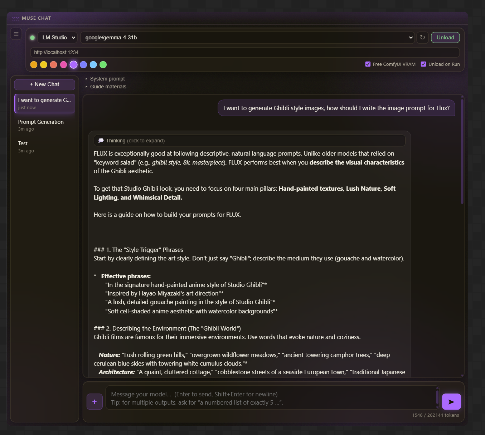
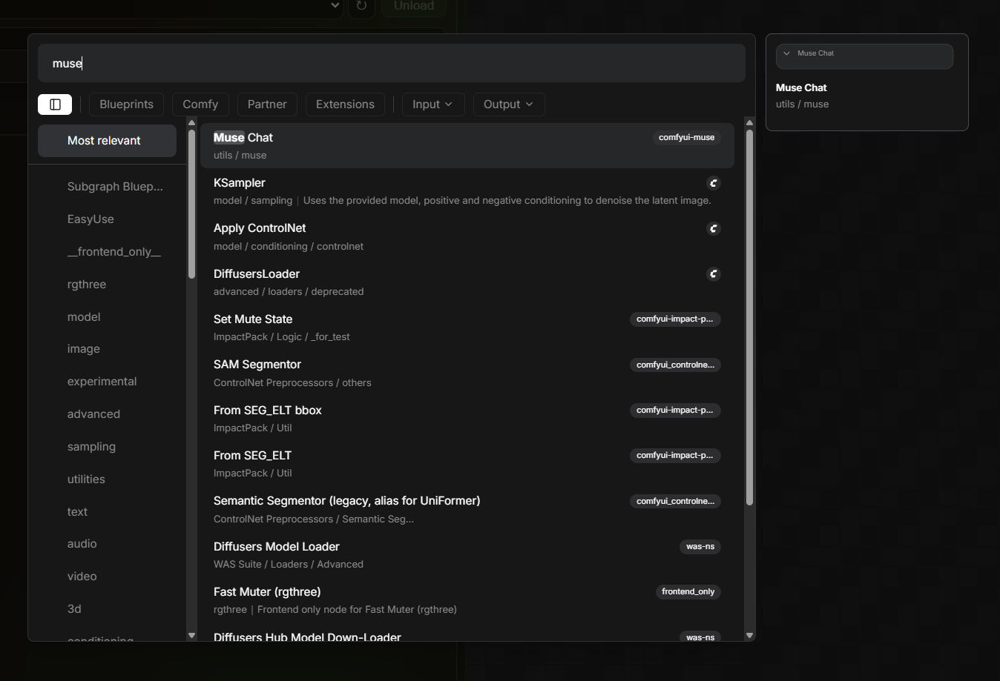
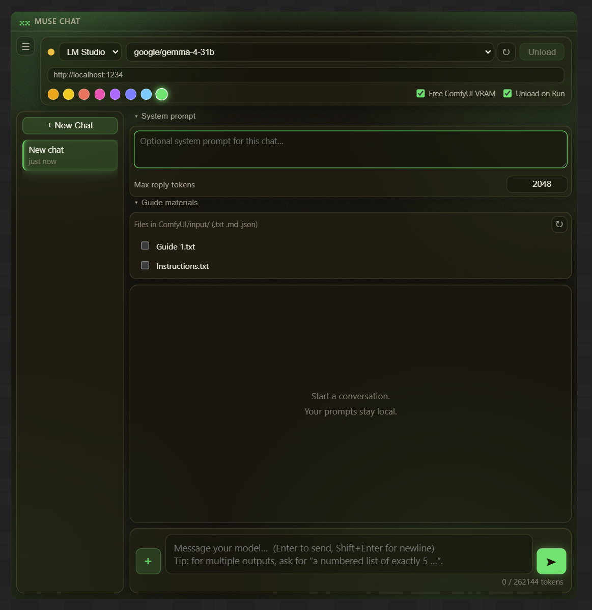
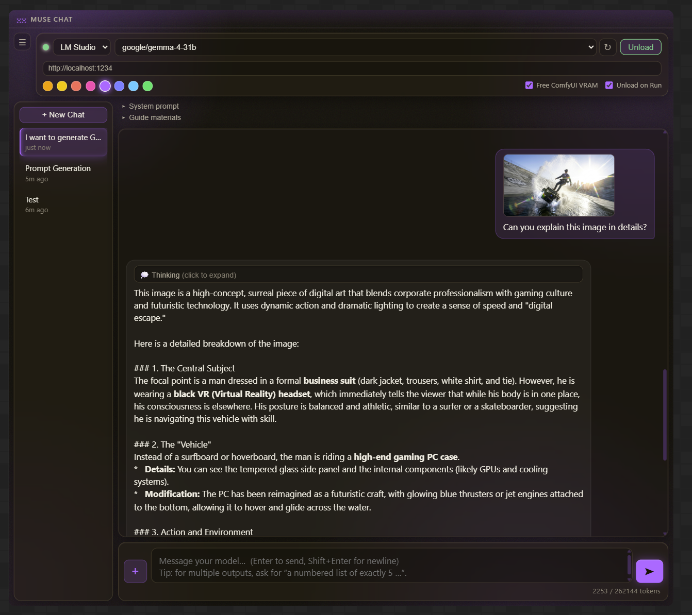

# ComfyUI-Muse

**🎉 V2 is out** — Direct model loader (no LM Studio/Ollama needed), audio attachments, edit & resend, chat branching, and more. Read the story in [RELEASE_NOTES.md](RELEASE_NOTES.md).

**A local LLM chat panel that lives inside a ComfyUI node. Brainstorm prompts without leaving your workflow.**

Muse embeds a persistent, multi-session chat interface (like LM Studio's chat panel) directly into a ComfyUI node. Talk to your locally-hosted LLMs, draft image/video prompts, then copy the text into your graph — no alt-tabbing between apps, and no juggling models in two places to manage VRAM.

It's a **true drop-in**: no `pip install`, no build step, and nothing to download to get the core chat panel running against LM Studio or Ollama. The only hard dependency is `aiohttp`, which already ships with ComfyUI. (Video attachments need `opencv-python`, and the Direct model loader — which skips LM Studio/Ollama entirely — pulls its own `llama-server` binary with a single click the first time you use it; both are opt-in and only matter if you use those specific features.)



## Features

- **Three backends** — LM Studio (`http://localhost:1234`), Ollama (`http://localhost:11434`), and a **Direct model loader** that runs GGUF models straight from disk with no other app needed, switchable on the fly. *(See [Direct model loader](#direct-model-loader).)*
- **Multi-session chats** — create, switch, rename (inline), and delete conversations. Each keeps its own history, system prompt, model, and settings. All saved to disk and restored across restarts.
- **Streaming replies** — responses render token-by-token, with a Stop button to cancel mid-generation.
- **Automatic model loading** — the model loads on your first message; an **Unload** button frees VRAM when you're done.
- **Two-way VRAM coordination** — free ComfyUI's VRAM before each chat, and unload the chat model (confirmed) before a ComfyUI render. No more "remember to unload before you hit Run." *(See [VRAM coordination](#vram-coordination).)*
- **Guide Materials** — per-chat reference files (style guides, conventions) from `ComfyUI/input/` that influence every message. *(See [Guide Materials](#guide-materials).)*
- **Image attachments** — attach images of virtually any format from `ComfyUI/input/` or drag-drop them onto the panel, for vision-capable models. *(See [Image attachments](#image-attachments).)*
- **Video attachments** — attach a video and chat about it with a video-capable vision model (e.g. Qwen3-VL): frames are sampled at a configurable fps, timestamped, and sent alongside your message. *(See [Video attachments](#video-attachments).)*
- **Audio attachments** — attach an audio file for audio-capable models (Qwen2.5-Omni, Ultravox, Voxtral, etc.) via the Direct loader. *(See [Audio attachments](#audio-attachments).)*
- **Reasoning model support** — `<think>…</think>` content renders as a collapsible "Thinking" block, separate from the answer.
- **Per-message actions** — Copy, Regenerate, Delete, and (on your own messages) Edit, on hover.
- **Edit & resend** — fix a message you sent instead of deleting and retyping it; resend to drop everything after it and regenerate from the edit.
- **Chat branching** — fork a new chat from any message in the conversation, not just the latest one, to explore an alternate direction without losing the original thread.
- **Configurable reply length** — per-chat **Max reply tokens** (default 2048) so multi-item outputs ("write 5 prompts") aren't cut off, with a hint when a reply hits the limit.
- **Token usage** — live `X / Y tokens` against the model's context length, including active guide cost.
- **Frosted-glass theme** with an **accent color picker** (8 colors, remembered between sessions).
- **Draggable + resizable** node with a dedicated title strip.

## Install

1. Copy this folder into your ComfyUI custom nodes directory:
   ```
   ComfyUI/custom_nodes/comfyui-muse/
   ```
2. Restart ComfyUI.
3. Add the node: right-click the canvas → **Add Node → utils → muse → Muse Chat** (or double-click and search "Muse Chat").

Chats are stored as JSON under `comfyui-muse/chats/` (created automatically, git-ignored). Direct-loader settings (folders, binary path) live in `comfyui-muse/muse_settings.json`, also git-ignored since they're machine-specific.



## Usage

1. Pick a backend and confirm the base URL.
2. Click **⟳** to list models, then select one.
3. Type a message and press **Enter** (**Shift+Enter** for a newline). The model loads automatically and the reply streams in.
4. Use **+ New Chat** and the sidebar to manage conversations.
5. Copy the prompt you like and paste it into your graph.

> This node has **no graph inputs or outputs** by design — copy/paste is the intended workflow. It's safely ignored by Queue Prompt and won't interfere with normal execution.



## VRAM coordination

Two toggles in the top bar let the LLM and ComfyUI share your GPU without fighting over it:

- **Free ComfyUI VRAM** *(default on)* — before each message reaches the LLM, Muse unloads ComfyUI's models and clears its cache, so the chat model loads into freed memory.
- **Unload on Run** *(default on)* — when you click ComfyUI's **Run/Queue**, Muse unloads the chat model first and **confirms** the VRAM is actually freed (polling the backend) before the render proceeds. It does not auto-reload afterward — just send a new message when you want to chat again.

The manual **Unload** button remains for freeing VRAM any time (e.g. stepping away).

## Guide Materials

Standing, per-chat reference material — style guides, conventions, anything that should shape *every* reply.

- Put `.txt`, `.md`, or `.json` files in `ComfyUI/input/`.
- Open the **Guide materials** section and check the ones you want active for this chat (selection is saved per chat).
- On every message, Muse reads those files **fresh from disk** and prepends them to the system prompt — so edits on disk are picked up automatically, and missing files are skipped (and flagged).
- Their token cost is folded into the usage meter.

## Image attachments

For vision-capable models, attach images per message:

- Click **+** to pick from images already in `ComfyUI/input/`, or **drag-and-drop** image files onto the panel (they're saved into `input/` first, then attached).
- Attached thumbnails show above the input; sent images render inline in the chat history.
- References (filenames) are stored in the chat — the image bytes are read live from `input/` each time, keeping chat files small.
- Any format Pillow can open (PNG, JPEG, WebP, GIF, BMP, TIFF, ICO, and more) is accepted — anything outside the small set most vision APIs actually document is transcoded to PNG automatically before it's sent, so odd formats don't get silently rejected by the backend.



## Video attachments

For video-capable vision models (e.g. Qwen3-VL), attach a video and ask about what happens in it, or draft editing/shot prompts from it:

- Click the **🎬** button to pick from videos already in `ComfyUI/input/`, or drag-and-drop a video file onto the panel.
- On send, Muse samples frames from the video at a configurable rate (**Video sampling**, in the system-prompt drawer — default **1 fps**, capped at a **max frames** count, default 24), downscales them, and sends each one to the model tagged with its timestamp (`t=0:03.00`, etc.) — the same "uniformly sample + timestamp" technique most video-understanding pipelines use, so the model can reason about ordering and change over time rather than seeing an unordered pile of stills.
- If the video is longer than `max_frames / fps` seconds, frames are evenly resampled across the *full* duration (not just the first N seconds), so a long video still gets end-to-end coverage.
- Like images, videos are attached by reference — frames are re-sampled live from `input/` each time they're actually sent, nothing is cached to disk.
- **Requires OpenCV** (`pip install opencv-python` in ComfyUI's Python environment) for frame extraction. If it's missing, Muse tells you so in the chat instead of failing silently.

## Audio attachments

For audio-capable models, attach an audio file per message the same way as images/video (**🎤** button or drag-and-drop):

- Raw file bytes are sent as-is (base64'd, tagged with the file format) — no server-side transcoding, since the model's own audio encoder handles decoding.
- **Backend support varies.** As of this writing, neither LM Studio's nor Ollama's API accepts audio input at all — attaching audio there gets you a heads-up in the chat and the attachment is left out of the request (Ollama) or sent speculatively in case a future version supports it (LM Studio). The **Direct loader** is the backend that actually works end-to-end today: llama.cpp's `llama-server` supports audio input (via its mtmd multimodal path) for models like Qwen2-Audio, Qwen2.5-Omni, Ultravox, and Voxtral, the same way it supports vision — pair the model's GGUF with its `mmproj` file and it just works.
- Muse flags whether the currently selected model looks audio-capable (by name) before you send, so you're not guessing.

## Direct model loader

Load GGUF chat models straight from disk — no LM Studio, no Ollama, nothing else to run.

**How it stays LM-Studio-fast:** this isn't a from-scratch inference implementation. LM Studio's own GGUF runtime *is* llama.cpp, so Muse spawns the same engine — llama.cpp's own `llama-server` — with the same techniques that make it fast: memory-mapped weights, full GPU layer offload, and flash attention. Once it's up it speaks the same OpenAI-compatible API LM Studio does, so the actual chat traffic goes through the exact same code path as the LM Studio backend. The speed comes from the engine, not from us — if `llama-server` is built with the right GPU backend for your machine, you should see LM-Studio-equivalent generation speed.

**Setup — no manual downloads needed:**

1. Switch the backend dropdown to **Direct (GGUF)** and open **Direct Loader settings**.
2. Click **Download llama-server**. Muse detects your OS/architecture, fetches the matching build straight from the [official llama.cpp releases](https://github.com/ggml-org/llama.cpp/releases), extracts it, and points itself at it — one click, nothing to unzip or configure by hand. The default download is the **Vulkan** build, which runs on NVIDIA/AMD/Intel GPUs alike with no extra runtime package to install; **Advanced download options** offers a CPU-only build or an NVIDIA-specific CUDA build (which pulls its required `cudart` companion package automatically too) if you want to try those instead. Already have a llama.cpp install? **Use existing install** checks `PATH` and common locations instead of downloading a new copy.
3. Add one or more folders to scan for `.gguf` models — your LM Studio models folder, a folder you downloaded models into, whatever. Click **Suggest folders** for a couple of common candidates, or paste a path and hit **Add**. Folders are scanned recursively.
4. Pick a model from the dropdown and start chatting — it loads automatically on your first message, same JIT-load behavior as LM Studio/Ollama.

If your platform doesn't have a matching build (e.g. Windows on ARM wanting GPU acceleration), the download button will say so — grab one manually from the [releases page](https://github.com/ggml-org/llama.cpp/releases) and paste its path in instead.

**Vision/audio (mmproj) models:** put the model's `.gguf` and its `mmproj-*.gguf` projector file in the **same folder**. Muse pairs them automatically and marks the model vision/audio-capable in the dropdown.

**Split models** (`model-00001-of-00003.gguf` etc.) are represented by their first shard — llama.cpp finds the rest automatically.

**Safety filter:** if you point Muse at your ComfyUI `models/` folder, its own diffusion-model GGUF checkpoints (Flux, SDXL, etc. — same file format, not a chat model) are automatically filtered out of the list, so you won't accidentally try to chat with a UNet.

**Settings** (Direct Loader settings drawer):

- **GPU layers (`-ngl`)** — how many layers to offload to GPU. Default `-1` = every layer. Click **Fit to GPU** to get a suggested value instead of guessing: it reads your free VRAM (via `nvidia-smi`) and the selected model's size/layer count and picks a layer count that should actually fit, the same idea as LM Studio's GPU Offload slider. If a load still runs out of memory, Muse automatically retries at progressively lower layer counts (100% → 75% → 50% → 25% → CPU-only) rather than just failing — check the **Log** panel to see which attempt succeeded.
- **Context length** — KV cache size, in tokens. Default **8192** (changed from `0`/"model's full trained context" — modern models often advertise 128k–262k tokens, and a KV cache sized for that is what actually pushes memory past what fits. On Vulkan this fails loudly with an out-of-memory error; on CUDA/Windows the driver can silently spill the overflow into system RAM instead, which doesn't crash but makes generation dramatically slower — the classic "it works, but it's not LM-Studio-fast" symptom. Raise this deliberately if you need longer conversations and have the VRAM for it). Settings saved before this change keep their old `0` value on disk — Muse will point this out once if that's the case.
- **Flash attention** — `auto` (default) / `on` / `off`.
- **Extra args** — any additional `llama-server` flags, passed through verbatim, for anything not exposed above.

One model runs at a time (loading a different one stops the previous process first) — same mental model as the LM Studio/Ollama backends here. **Unload** terminates the process outright, so VRAM release is immediate and guaranteed rather than polled.

**Model-load feedback:** while a model is loading, the message input area shows a live elapsed-time counter instead of sitting silently — `llama-server` doesn't expose a real load percentage, so this is an honest "how long has this been running" readout rather than a fake progress bar. First loads of large models can take a while, especially from a cold disk cache.

**Log panel:** click **Log** (next to System prompt / Guide materials) for a retractable, persistent panel showing chat-level messages that would otherwise auto-dismiss, plus — while the Direct backend is selected — `llama-server`'s own process log and live stderr tail, refreshed automatically while the panel is open. Useful for seeing exactly why a load failed or which GPU-layer fallback it landed on.

## Use cases

- Iterating on prompts for image/video generation right next to your workflow.
- Using a local model to expand, rewrite, or clean up tag lists and structured prompts.
- Keeping per-project chat threads with their own system prompts and guide files (e.g. a house style guide that shapes every prompt).
- Describing a reference image to a vision model and asking for a prompt "in this style."
- Managing VRAM hands-free — chat freely, then just hit Run and let Muse get out of the GPU's way.
- Feeding a source video to a video-capable model to get a shot-by-shot breakdown or an editing prompt.
- Branching a chat to try a different direction from an earlier point, without losing the original line of conversation.
- Running everything through the Direct loader when you'd rather not keep LM Studio open at all.
- Transcribing or discussing an audio clip with an audio-capable model via the Direct loader.

## Requirements

- A recent ComfyUI (supports custom DOM widgets).
- At least one working backend: a running **LM Studio** and/or **Ollama** on the same machine with a model available, and/or the **Direct loader** — click **Download llama-server** and point it at a folder of GGUF models, no other app required.
- For image attachments: a vision-capable model.
- For video attachments: a video-capable vision model (e.g. Qwen3-VL), and `opencv-python` installed in ComfyUI's Python environment for frame extraction.
- For audio attachments: an audio-capable model (e.g. Qwen2.5-Omni, Ultravox, Voxtral) loaded via the Direct backend — LM Studio and Ollama don't support audio input yet.

## Support

If Muse is useful to you, consider [buying me a coffee on Ko-fi](https://ko-fi.com/rudysen) — appreciated, never expected. Also find me on Instagram [@rudysen_official](https://www.instagram.com/rudysen_official/).

See [RELEASE_NOTES.md](RELEASE_NOTES.md) for what's new in V2.

## License

MIT.
